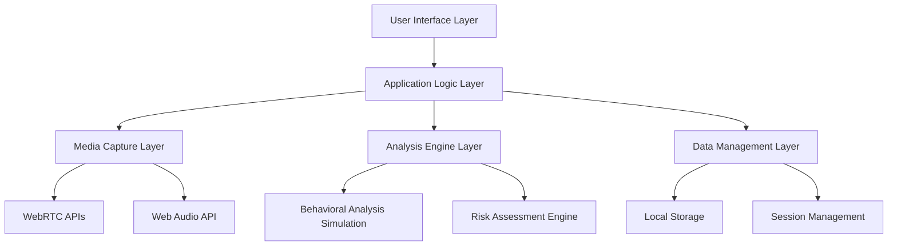
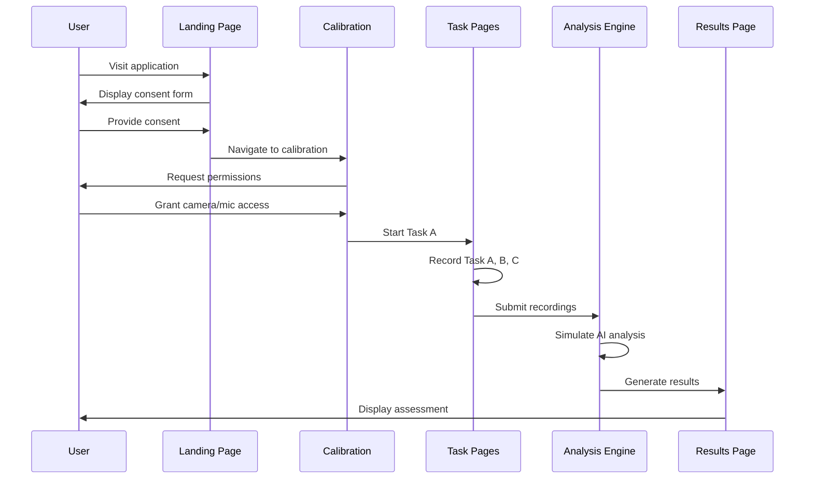

# Design Document

## Overview

The AI-Powered Early Autism Risk Detector is a React-based web application that provides a comprehensive screening tool for early autism risk assessment in toddlers. The application leverages modern web technologies including WebRTC for media capture, Web Audio API for real-time audio analysis, and client-side processing to ensure privacy and security.

The system follows a progressive workflow design, guiding users through consent, device setup, three structured assessment tasks, AI analysis simulation, and results presentation. The architecture prioritizes user experience, accessibility, and data privacy while providing meaningful behavioral insights.

## Architecture

### High-Level Architecture



### Technology Stack

- **Frontend Framework**: React 19 with TypeScript
- **UI Components**: shadcn/ui with Radix UI primitives
- **Styling**: Tailwind CSS with custom animations
- **Routing**: React Router DOM v6
- **State Management**: Zustand for global state
- **Media Capture**: WebRTC getUserMedia API
- **Audio Processing**: Web Audio API with AnalyserNode
- **Build Tool**: Vite with SWC
- **Package Manager**: pnpm

### Application Flow



## Components and Interfaces

### Core Components

#### 1. VideoCapture Component
**Purpose**: Handles real-time video capture and recording functionality

**Key Features**:
- WebRTC stream management with error handling
- Recording state indicators and visual feedback
- Responsive video preview with aspect ratio preservation
- Camera permission management and retry mechanisms

**Interface**:
```typescript
interface VideoCaptureProps {
  onReady?: () => void;
  isRecording?: boolean;
  onStartRecording?: () => void;
  onStopRecording?: () => void;
  showControls?: boolean;
}
```

#### 2. AudioCapture Component
**Purpose**: Manages audio recording and real-time audio level visualization

**Key Features**:
- Web Audio API integration for real-time analysis
- Visual audio level indicators with color-coded feedback
- Audio permission handling and error recovery
- Real-time frequency analysis for audio quality assessment

**Interface**:
```typescript
interface AudioCaptureProps {
  onReady?: () => void;
  isRecording?: boolean;
  showVisualizer?: boolean;
}
```

#### 3. Task Components (TaskA, TaskB, TaskC)
**Purpose**: Structured assessment interfaces for each behavioral observation task

**Key Features**:
- Task-specific instructions and guidance
- Progress tracking and timing controls
- Recording management with retry capabilities
- Behavioral prompt systems for consistent assessment

#### 4. Analysis Engine
**Purpose**: Simulates AI-powered behavioral analysis of captured media

**Key Features**:
- Mock gaze tracking analysis
- Facial expression pattern recognition simulation
- Audio pattern analysis for vocalization assessment
- Risk score calculation based on behavioral indicators

#### 5. Results Visualization
**Purpose**: Presents assessment results in an accessible, understandable format

**Key Features**:
- Visual risk score indicators with color coding
- Behavioral flag highlighting with explanations
- Downloadable PDF report generation
- Clear next-step recommendations

### State Management Architecture

```typescript
interface AppState {
  // User session data
  consentGiven: boolean;
  currentTask: 'calibration' | 'taskA' | 'taskB' | 'taskC' | 'analysis' | 'results';
  
  // Media capture state
  cameraReady: boolean;
  microphoneReady: boolean;
  isRecording: boolean;
  
  // Task completion tracking
  tasksCompleted: {
    taskA: boolean;
    taskB: boolean;
    taskC: boolean;
  };
  
  // Analysis results
  analysisResults: {
    riskScore: number;
    behavioralFlags: BehavioralFlag[];
    recommendations: string[];
  };
  
  // Error handling
  errors: {
    camera?: string;
    microphone?: string;
    recording?: string;
  };
}
```

## Data Models

### Recording Data Structure
```typescript
interface RecordingData {
  taskId: 'taskA' | 'taskB' | 'taskC';
  videoBlob: Blob;
  audioBlob: Blob;
  duration: number;
  timestamp: Date;
  metadata: {
    resolution: string;
    frameRate: number;
    audioSampleRate: number;
  };
}
```

### Behavioral Analysis Results
```typescript
interface BehavioralFlag {
  category: 'gaze' | 'facial_expression' | 'vocalization' | 'motor_behavior';
  severity: 'low' | 'moderate' | 'high';
  description: string;
  confidence: number;
  timestamp?: number;
}

interface AnalysisResults {
  overallRiskScore: number; // 0-100 scale
  taskResults: {
    taskA: TaskAnalysis;
    taskB: TaskAnalysis;
    taskC: TaskAnalysis;
  };
  behavioralFlags: BehavioralFlag[];
  recommendations: Recommendation[];
  disclaimers: string[];
}

interface TaskAnalysis {
  gazePatterns: {
    eyeContact: number;
    jointAttention: number;
    visualTracking: number;
  };
  facialExpressions: {
    emotionalRange: number;
    socialSmiling: number;
    responseToName: number;
  };
  vocalizationPatterns: {
    frequency: number;
    variety: number;
    socialVocalizations: number;
  };
  motorBehaviors: {
    repetitiveMovements: number;
    purposefulActions: number;
    coordinatedMovements: number;
  };
}
```

### Report Generation Data
```typescript
interface AssessmentReport {
  childInfo: {
    age: string;
    assessmentDate: Date;
  };
  summary: {
    overallRisk: 'low' | 'moderate' | 'high';
    keyFindings: string[];
    recommendations: string[];
  };
  detailedResults: AnalysisResults;
  disclaimers: string[];
  nextSteps: string[];
}
```

## Error Handling

### Media Access Error Handling
```typescript
enum MediaError {
  PERMISSION_DENIED = 'Permission denied for camera/microphone access',
  DEVICE_NOT_FOUND = 'Camera or microphone not found',
  CONSTRAINT_NOT_SATISFIED = 'Camera/microphone constraints not supported',
  UNKNOWN_ERROR = 'Unknown media access error'
}

interface ErrorRecoveryStrategy {
  error: MediaError;
  userMessage: string;
  recoveryActions: string[];
  fallbackOptions?: string[];
}
```

### Recording Error Handling
- Automatic retry mechanisms for failed recordings
- Graceful degradation when media quality is poor
- User-friendly error messages with clear resolution steps
- Fallback options for unsupported browsers or devices

### Analysis Error Handling
- Timeout handling for long-running analysis processes
- Fallback to simplified analysis if full processing fails
- Clear error reporting with suggested next steps
- Data validation before analysis processing

## Testing Strategy

### Unit Testing Approach
- **Component Testing**: Individual component functionality and prop handling
- **Hook Testing**: Custom hooks for media capture and state management
- **Utility Testing**: Analysis algorithms and data processing functions
- **Error Handling Testing**: Error scenarios and recovery mechanisms

### Integration Testing Approach
- **Media Capture Flow**: End-to-end camera and microphone functionality
- **Task Progression**: Complete workflow from consent to results
- **State Management**: Cross-component state synchronization
- **Browser Compatibility**: WebRTC and Web Audio API support across browsers

### User Experience Testing
- **Accessibility Testing**: Screen reader compatibility and keyboard navigation
- **Responsive Design Testing**: Mobile and tablet device compatibility
- **Performance Testing**: Media processing performance on various devices
- **Usability Testing**: Task completion rates and user feedback collection

### Mock Data Strategy
```typescript
// Simulated analysis results for testing
const mockAnalysisResults: AnalysisResults = {
  overallRiskScore: 25,
  taskResults: {
    taskA: {
      gazePatterns: { eyeContact: 70, jointAttention: 60, visualTracking: 80 },
      facialExpressions: { emotionalRange: 75, socialSmiling: 65, responseToName: 70 },
      vocalizationPatterns: { frequency: 60, variety: 55, socialVocalizations: 50 },
      motorBehaviors: { repetitiveMovements: 20, purposefulActions: 85, coordinatedMovements: 80 }
    },
    // ... similar for taskB and taskC
  },
  behavioralFlags: [
    {
      category: 'vocalization',
      severity: 'low',
      description: 'Limited vocal responses during name-calling task',
      confidence: 0.7
    }
  ],
  recommendations: [
    'Continue monitoring social communication development',
    'Consider follow-up assessment in 3-6 months'
  ],
  disclaimers: [
    'This is a screening tool, not a diagnostic instrument',
    'Professional evaluation recommended for comprehensive assessment'
  ]
};
```

## Privacy and Security Design

### Data Processing Architecture
- **Local Processing**: All analysis performed client-side using Web APIs
- **No Server Storage**: Media data never transmitted to external servers
- **Session-Based Storage**: Temporary data cleared after session completion
- **User Control**: Explicit data deletion options at multiple points

### Privacy Controls
```typescript
interface PrivacySettings {
  dataRetention: 'session-only' | 'local-storage' | 'user-controlled';
  analyticsEnabled: boolean;
  reportSharing: boolean;
  automaticDeletion: boolean;
}
```

### Security Measures
- **HTTPS Enforcement**: Secure media capture requires HTTPS
- **Permission Validation**: Explicit user consent for all media access
- **Data Encryption**: Local storage encryption for sensitive data
- **Cross-Origin Protection**: Strict content security policies

## Performance Considerations

### Media Processing Optimization
- **Efficient Encoding**: Optimized video/audio compression for analysis
- **Progressive Loading**: Chunked processing for large media files
- **Memory Management**: Proper cleanup of media streams and analysis data
- **Background Processing**: Web Workers for intensive analysis tasks

### User Experience Optimization
- **Loading States**: Clear progress indicators during processing
- **Responsive Design**: Optimized layouts for various screen sizes
- **Accessibility**: WCAG 2.1 AA compliance for inclusive design
- **Performance Monitoring**: Real-time performance metrics and optimization

## Deployment and Browser Support

### Browser Compatibility
- **Modern Browsers**: Chrome 88+, Firefox 85+, Safari 14+, Edge 88+
- **WebRTC Support**: Required for media capture functionality
- **Web Audio API**: Required for real-time audio analysis
- **Progressive Enhancement**: Graceful degradation for unsupported features

### Deployment Architecture
- **Static Hosting**: Optimized for CDN deployment (Vercel, Netlify)
- **Build Optimization**: Tree-shaking and code splitting for minimal bundle size
- **Asset Optimization**: Compressed images and optimized font loading
- **Caching Strategy**: Efficient caching for static assets and API responses